# 관통프로젝트: HappyHouse_Vue_대전_03반_김민혁_이아름 
### 제출일: 2020.11.16 21시 30분

### 참여 페어
- 김민혁(조장), 이아름

- HappyHouse Spring 프로젝트에서 요구하는 대부분의 기능은 구현했지만, 디버깅을 완료하지 못해서 현재 페이지 연결에는 오류가 있 습 니다. 

### 처리된 요구사항 목록 - Spring
  
|난이도|구현기능|세부|작성여부(O/X)|
|:---:|---|---|:---:|
|기본|메인페이지||O|
|기본|회원관리페이지|회원정보 등록화면|△|
|기본|회원관리페이지|회원정보 수정화면|△|
|기본|회원관리페이지|회원정보 삭제화면|△|
|기본|회원관리페이지|회원정보 검색화면|△|
|기본|로그인/로그아웃 페이지||O|
|기본|아파트 실거래가 검색,결과 페이지|전체검색화면|△|
|기본|아파트 실거래가 검색,결과 페이지|상세검색화면|△|
|기본|아파트 실거래가 검색,결과 페이지|동별화면|△|
|기본|아파트 실거래가 검색,결과 페이지|아파트별검색화면|△|
|추가||비밀번호찾기/사이트맵/메뉴구성|△|
|추가|관심지역 동네 업종 정보||X|
|추가|관심지역 대기 오염 정보||X|
|심화||웹사이트 소개|△|
|심화||공지사항|△|

### 처리된 요구사항 목록 - Vue
|난이도|구현기능|세부|작성여부(O/X)|
|:---:|---|---|:---:|
|기본|QnA 게시판 Vue|게시글 목록|O|
|기본|QnA 게시판 Vue|게시글 등록|O|
|기본|QnA 게시판 Vue|게시글 수정|X|
|기본|QnA 게시판 Vue|게시글상세 조회|O|
|기본|서버측 구현|게시글 등록|O|
|기본|서버측 구현|게시글 수정|O|
|기본|서버측 구현|게시글 삭제|O|
|기본|서버측 구현|게시글 상세조회|O|
|기본|서버측 구현|게시글 목록|O|
|추가|동네 업종 정보 조회||X|
|추가|동네 환경 점검 정보 조회||X|
|심화|메인 페이지 or 추가기능||X|

* 작성된 기능은 반드시 캡쳐되어야 합니다. 
* 추가로 구현한 기능을 표에 추가시키세요.

### 실행화면 캡쳐 - 

> 구현 기능: Spring (Controller, Model(Dao, Service, Dto)
1. 메인페이지
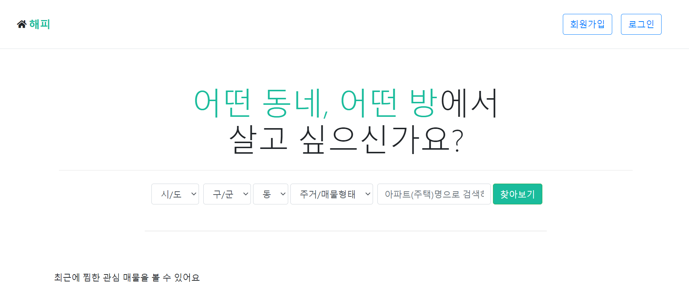

2. 로그인  
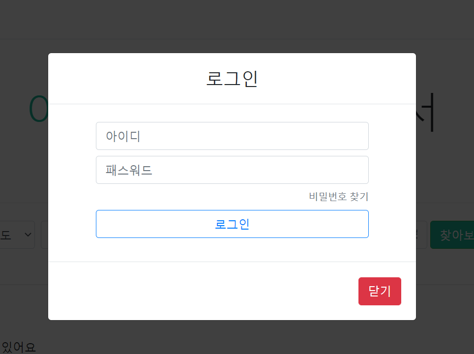

3. 회원가입  
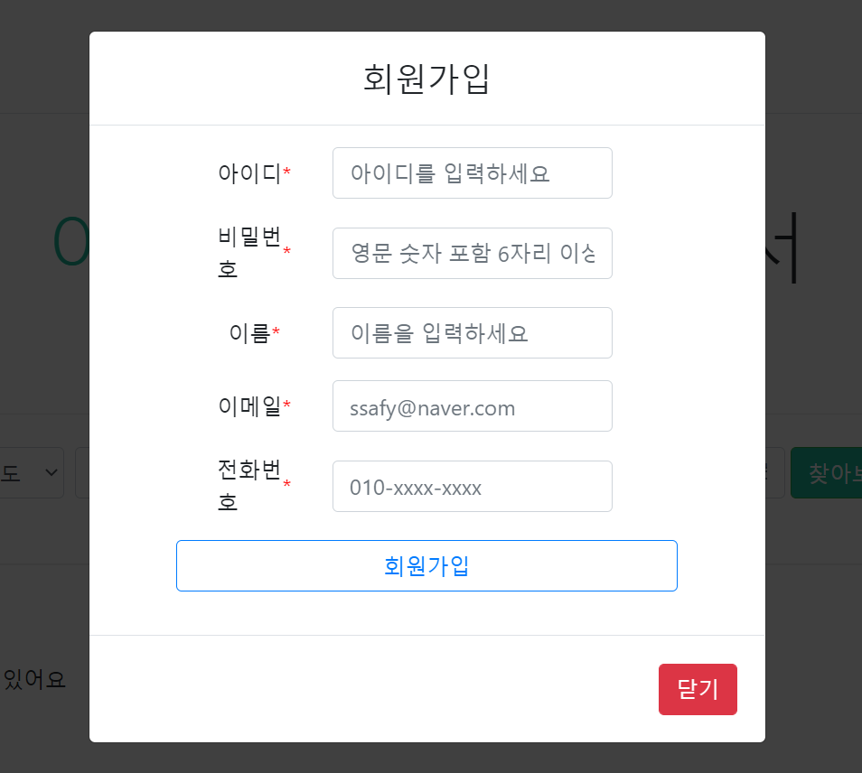

4. SearchController  
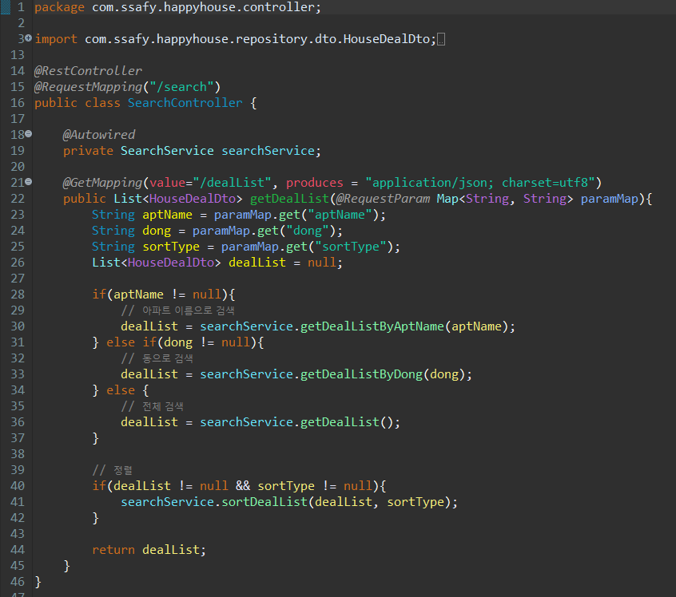

5. MemberController  
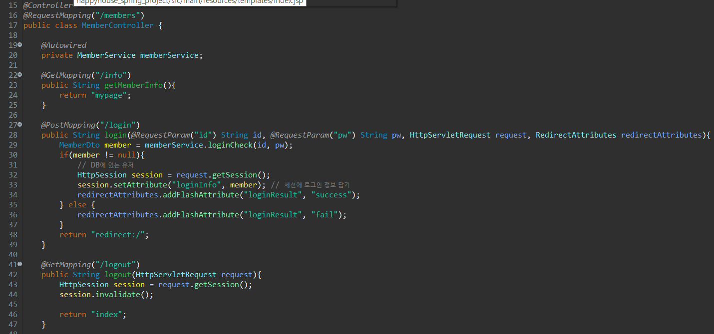
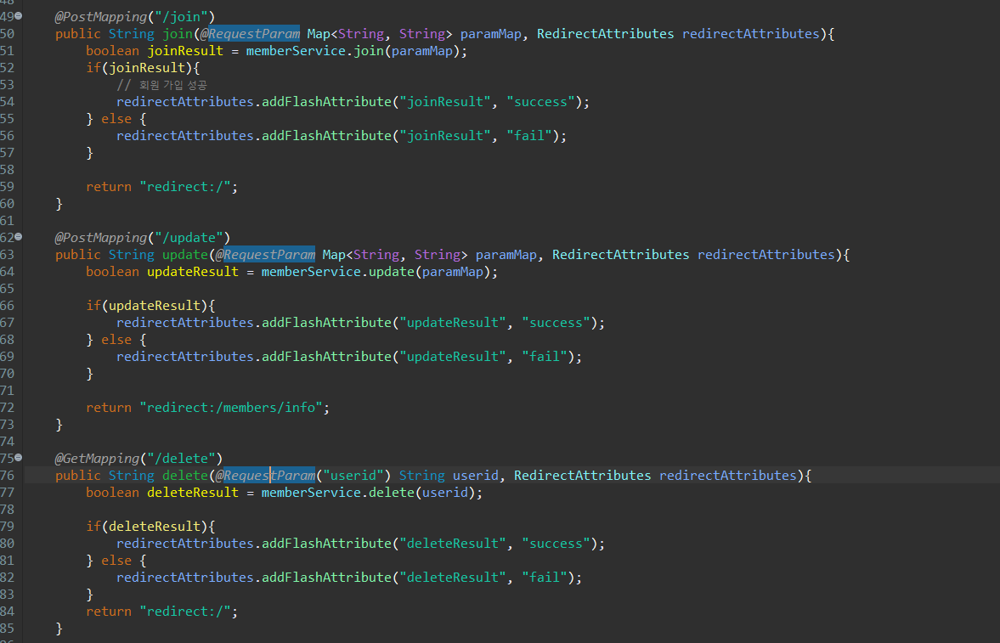
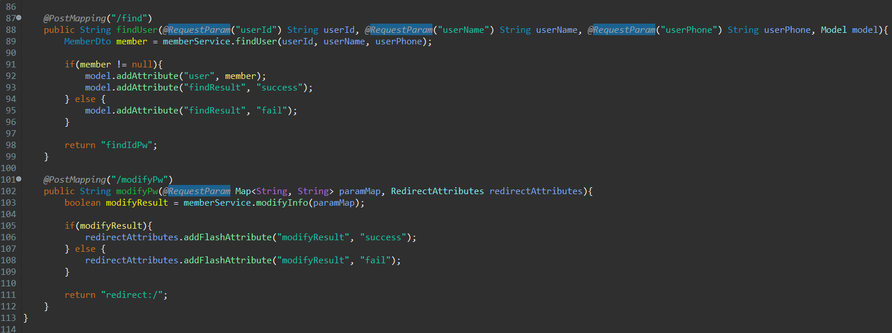

6. MapController  
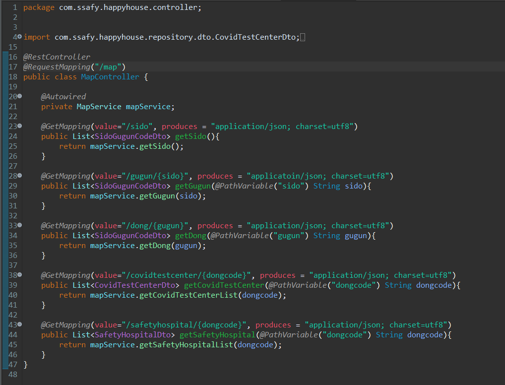

7. BoardController  
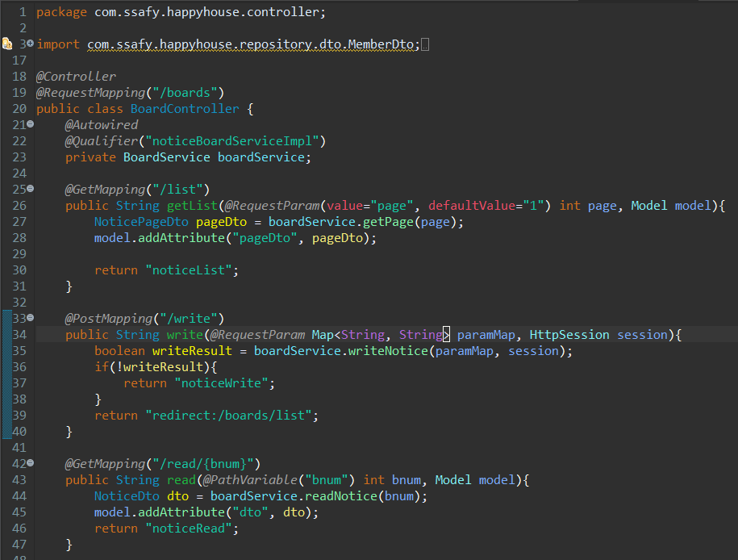
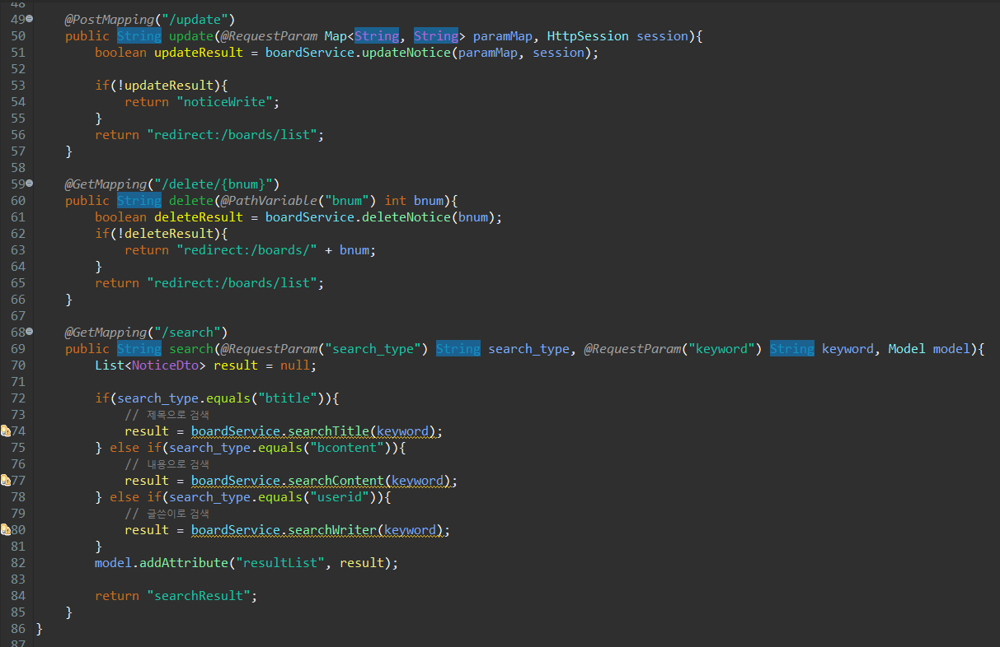

> 구현 기능: 전체 프로그램 동작/오류 없이 전체 동작 1

1. 메인페이지  
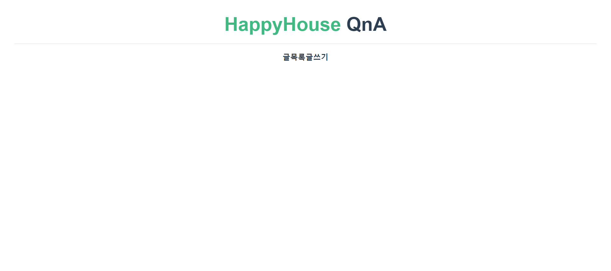

2. QnA 리스트  
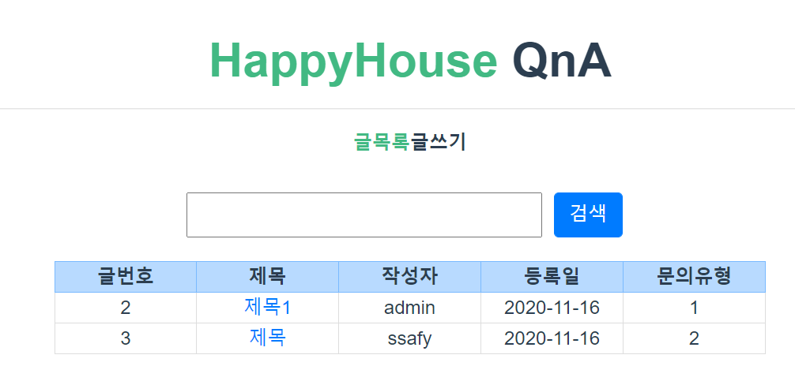

3. QnA 리스트(검색 후)  
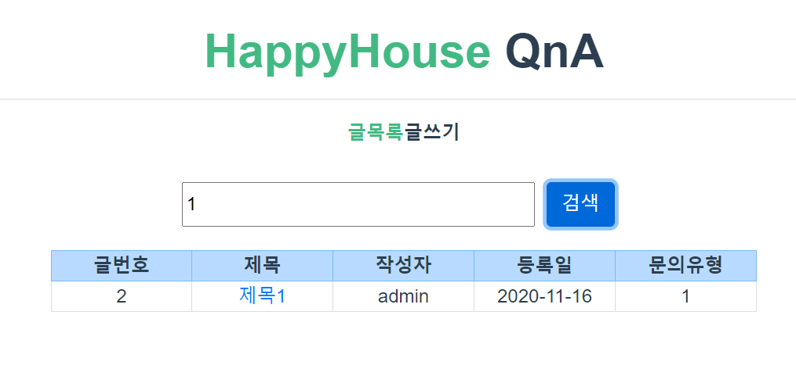

4. QnA 상세보기  
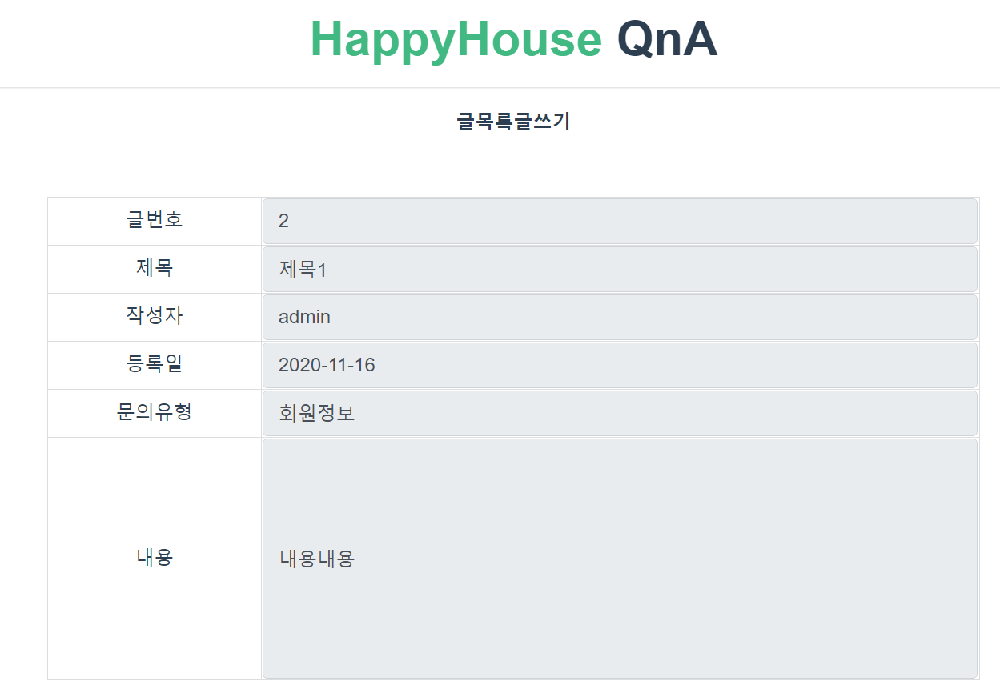

5. QnA 작성  
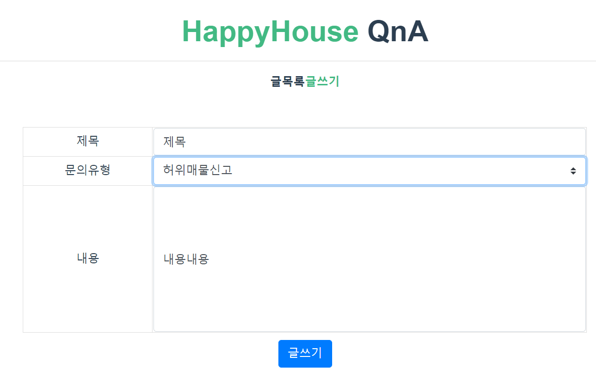

6. QnA 작성 성공 메세지  
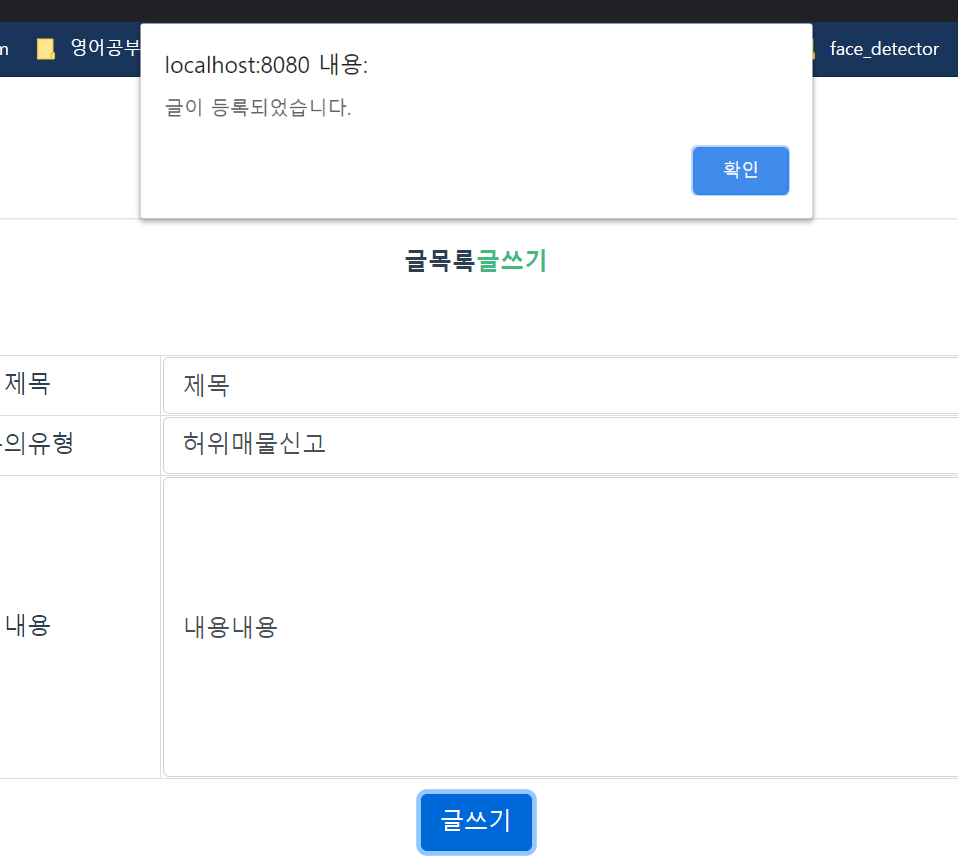

7. QnA 작성후 리스트  
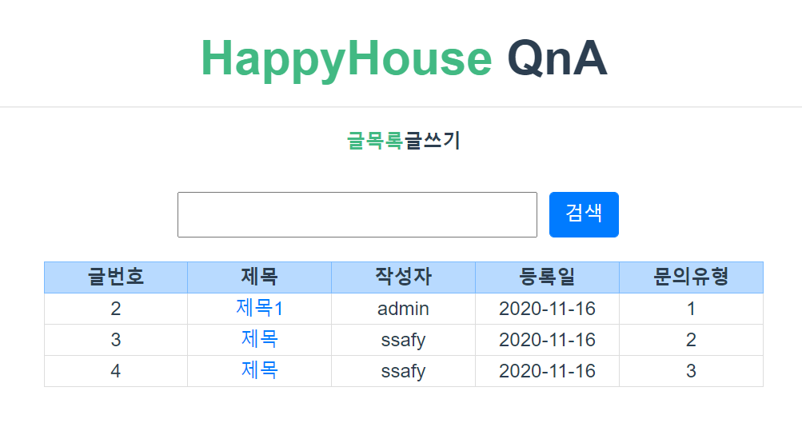

