# :house: **HappyHouse_SpringBoot_Pjt** :house:

 > :computer: 기존의 HappyHouse 프로젝트를 Spring Boot Framework 와 myBatis Framework를 활용하여 웹 서버를 재구축한다.
 
 > :runner:  팀원: 김민혁, 이아름
 
 > :clock2: 작업기간: 2020년 11월 0일 13:00 ~ 24:00 (11H)

# 파일 구성 및 DB 구조

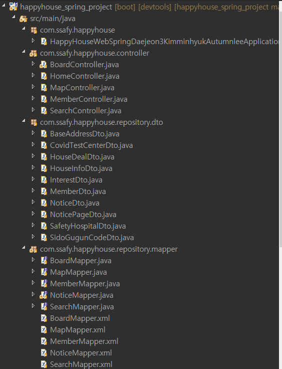  
  

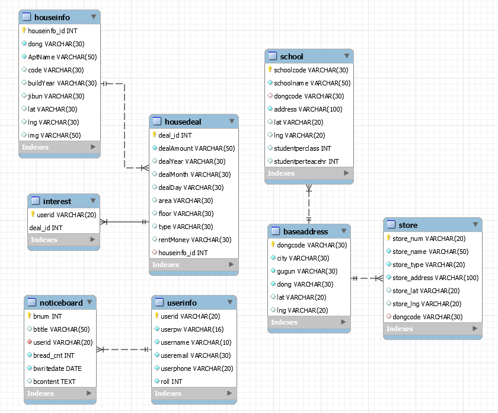

# 컨트롤러 myBatis 변경사항

### 1. BoardController.java
 
 

### 2. MapController.java

### 3. MemberController.java

### 4. SearchController

-------------------------------------------------------------------------------------------------

# 구현 기능

## :purple_heart: 1. 기본(필수) 기능

### 1) 메인페이지(실거래 정보를 활용하여 구성)(Spring Boot & MyBatis 기반)  

### - 로그인 전 메인페이지    
  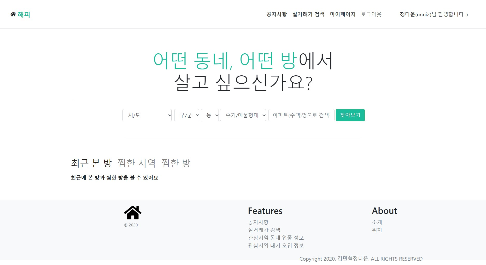  
  
### - 관리자가 로그인한 후 메인페이지 => 회원검색 메뉴 보임  
  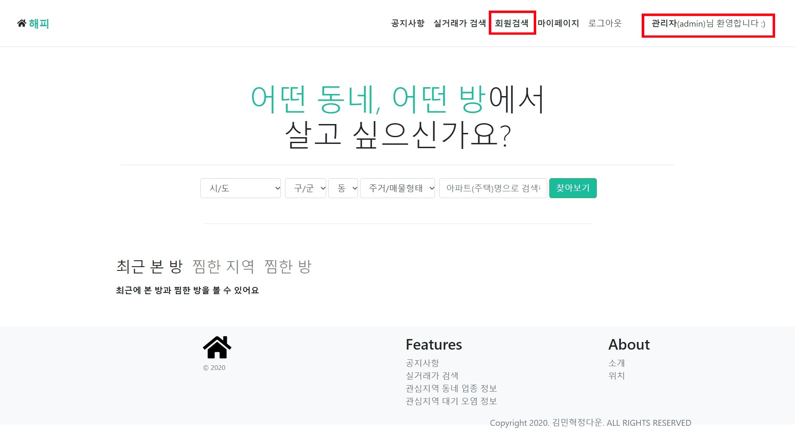  

### 2) 동별 실거래가 검색 결과 페이지(Spring Boot & MyBatis 기반)

### - 메인창에서 검색(메인 화면에서 아파트 이름이나 동으로 검색하면 HouseSearchController 서블릿으로 request를 전송하고 해당 서블릿에서 데이터를 받아 결과 화면에 전송합니다.)
  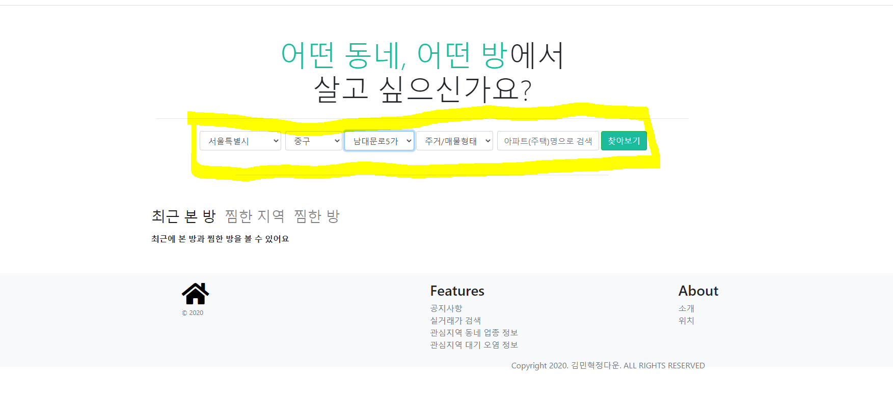     

### - 상세 검색 화면(검색 화면에서 검색 방법이나 정렬 방법을 선택해 HouseSearchController 서블릿으로 요청을 보내면 해당 서블릿에서 데이터를 받아 결과 화면을 보여줍니다.)
  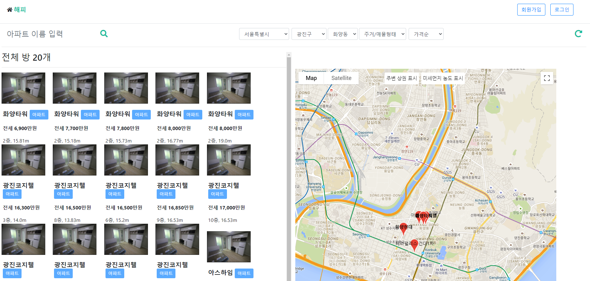     
  
### - 상세 검색 실패(로그인 안한 경우) (상세 검색 기능은 로그인 한 유저에게만 가능하도록 했습니다. 로그인 하지 않은 상태에서 상세한 정보를 보려고 할 경우 로그인을 하라는 창을 보여줍니다.)
  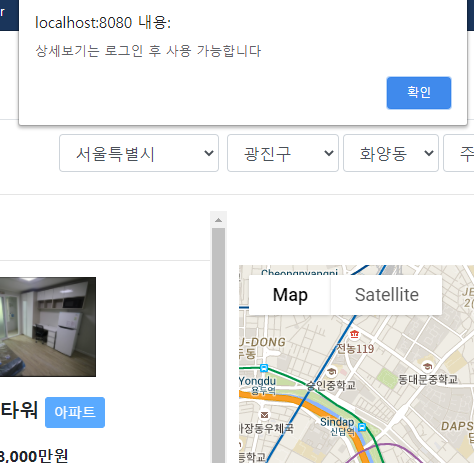     
   

### - 상세 검색 성공(로그인 한 경우)  (로그인 한 이후 상세 검색을 시도하면 해당 집의 평면도와 가격, 거래 등록 날짜 등 해당 매물의 상세한 정보를 보여줍니다.)
  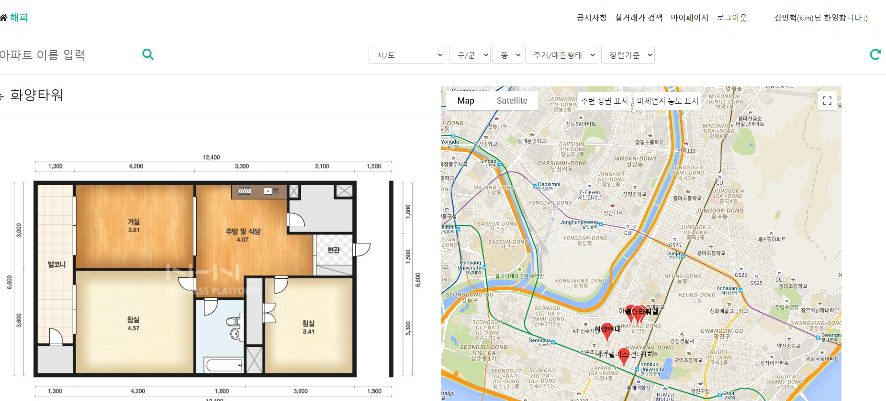     
   

### 3) 아파트별 실거래가 검색 결과 페이지(Spring Boot & MyBatis 기반)

### - 메인창에서 검색(메인 화면에서 아파트 이름으로 검색하면 HouseSearchController 서블릿으로 request를 전송하고 해당 서블릿에서 데이터를 받아 결과 화면에 전송합니다.
      
 
### - 상세 검색 화면(검색 화면에서 검색 방법이나 정렬 방법을 선택해 HouseSearchController 서블릿으로 요청을 보내면 해당 서블릿에서 데이터를 받아 결과 화면을 보여줍니다.)
      

### - 상세 검색 실패(로그인 안한 경우) (상세 검색 기능은 로그인 한 유저에게만 가능하도록 했습니다. 로그인 하지 않은 상태에서 상세한 정보를 보려고 할 경우 로그인을 하라는 창을 보여줍니다.)
      

### - 상세 검색 성공(로그인 한 경우)  (로그인 한 이후 상세 검색을 시도하면 해당 집의 평면도와 가격, 거래 등록 날짜 등 해당 매물의 상세한 정보를 보여줍니다.)
      

### - 아파트 명으로 검색  
  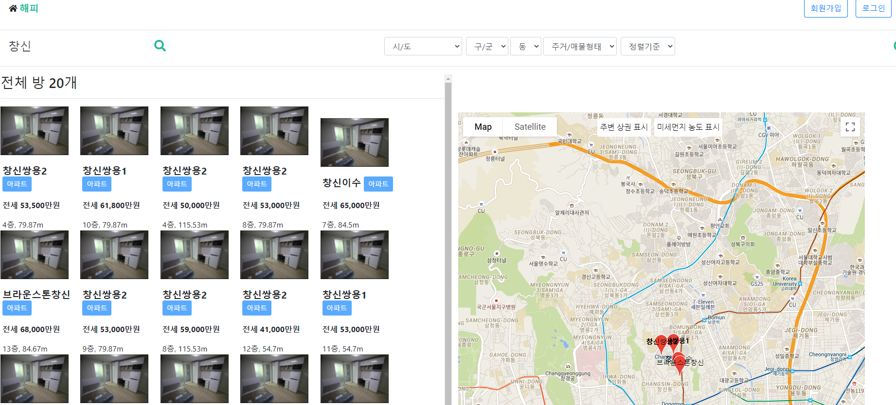  

### 4) 회원정보 등록, 수정, 삭제, 검색 페이지(Spring Boot & MyBatis 기반)

### - 회원등록
  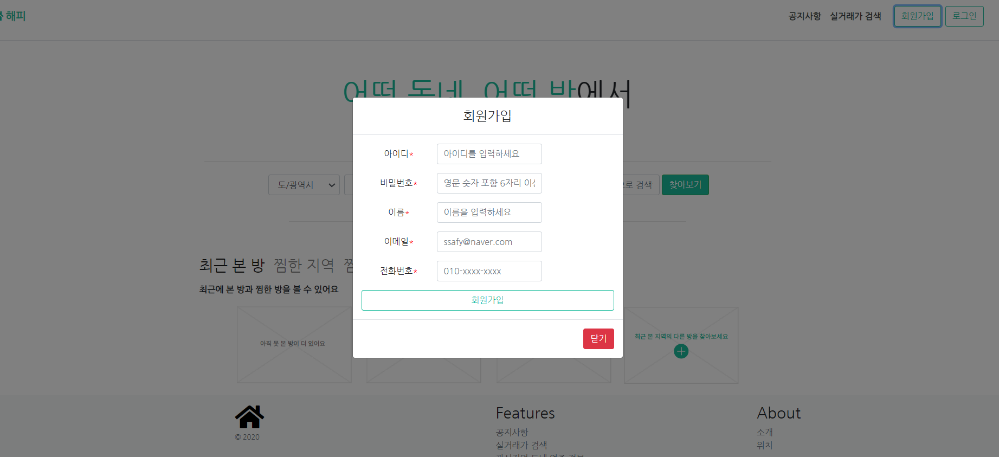  

### - 회원가입 성공 후 팝업창
  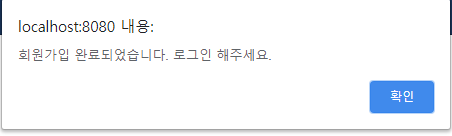    

### - 회원정보  
  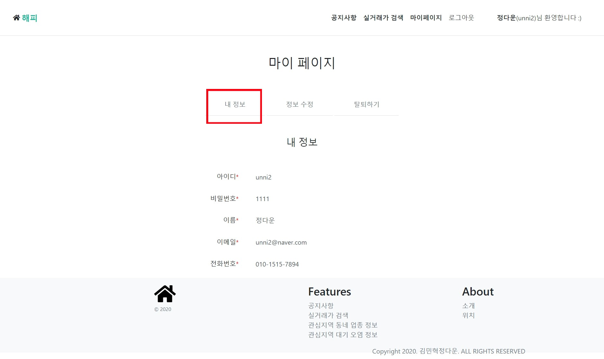    
 
### - 회원수정(사용자의 회원 정보를 수정할 수 있다.)
  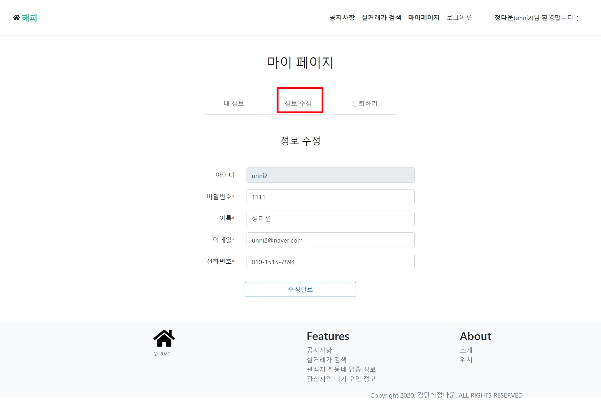    
  
### - 회원삭제(탈퇴)(사용자가 현재 계정을 탈퇴할 수 있다.)
  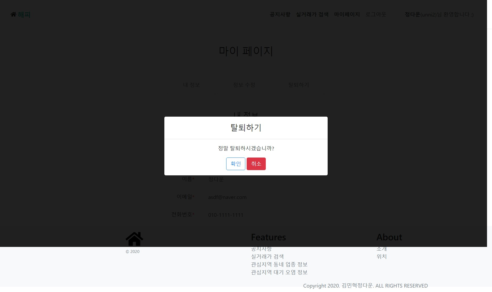    
  
### - 관리자모드에서 회원검색(관리자 모드에서는 현재 사이트에 가입된 모든 회원 리스트를 조회할 수 있다.)
  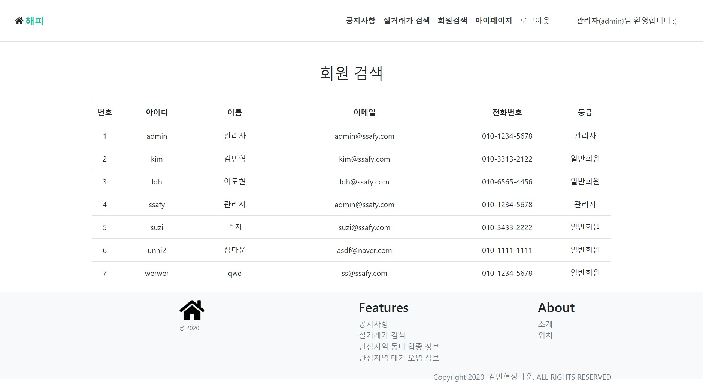    

### - 메인창에서 검색(메인 화면에서 동으로 검색하면 HouseSearchController 서블릿으로 request를 전송하고 해당 서블릿에서 데이터를 받아 결과 화면에 전송합니다.) 
      
   
### - 회원수정(사용자의 회원 정보를 수정할 수 있다.)
      
  
### - 회원삭제(탈퇴)(사용자가 현재 계정을 탈퇴할 수 있다.)
      
  
### - 관리자모드에서 회원검색(관리자 모드에서는 현재 사이트에 가입된 모든 회원 리스트를 조회할 수 있다.)
      
  
### - 비밀번호 찾기 실패  
  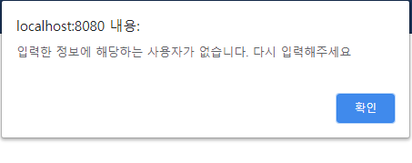  

### - 비밀번호 수정 실패(입력한 비밀번호가 서로 다르면 다시 입력하라는 창을 띄워줍니다.)
  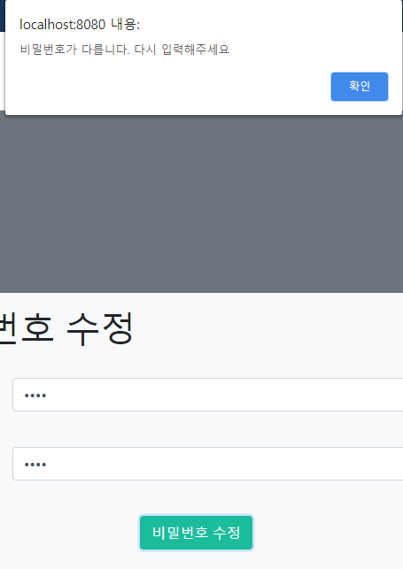  

### - 비밀번호 수정 성공(비밀번호 수정에 성공한 경우 성공했다는 창을 띄워줍니다.)
  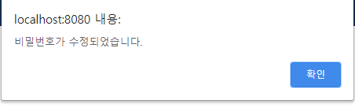  
 

### 5) 로그인/로그아웃 페이지(Spring Boot & MyBatis 기반)

### - 로그인
  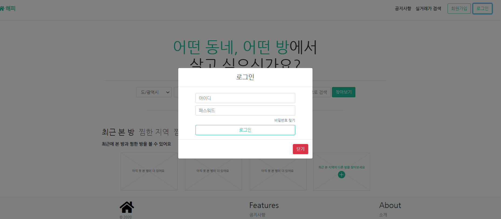  

### - 로그아웃
  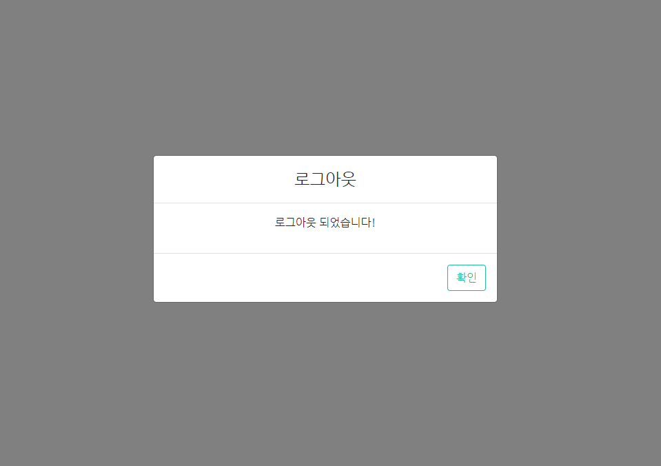  

### 6) 각 서비스별 클래스 설계

### (1) 실거래 정보 관리
### (실거래 메인페이지, 실거래 지역 검색, 실거래 상세 검색)

### (2) 회원 정보 관리
### (회원가입, 회원정보조회, 회원정보수정, 회원정보삭제, 로그인/로그아웃기능)

-------------------------------------------------------------------------------------------------

## :purple_heart: 2. 추가기능

### 1) 검색한 매물 주위 편의점 위치를 지도에 표시한다    

### 2) 인근 국민 안심 병원 및 코로나 선별 진료소의 위치를 지도에 표시한다

-------------------------------------------------------------------------------------------------

## :purple_heart: 3. 심화기능

### 1) 공지사항 관리 구현

### 공지사항 페이지에서는 글등록, 삭제, 수정, 검색할 수 있습니다.

### (1) 공지사항 등록(삭제 버튼을 누르면 한번 더 경고창이 뜨고, 사용자의 선택에 따라 다음 로직을 수행한다.)
  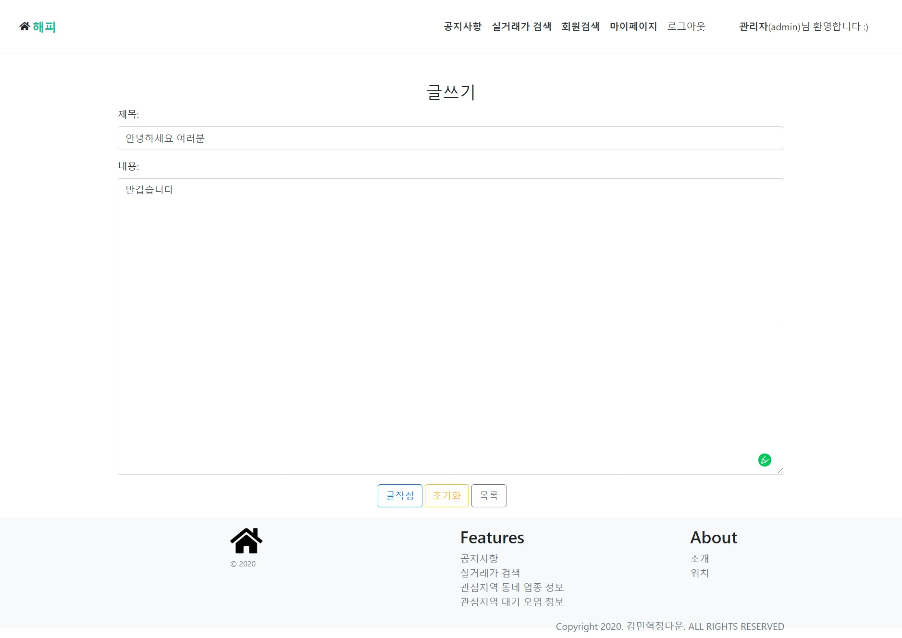    
  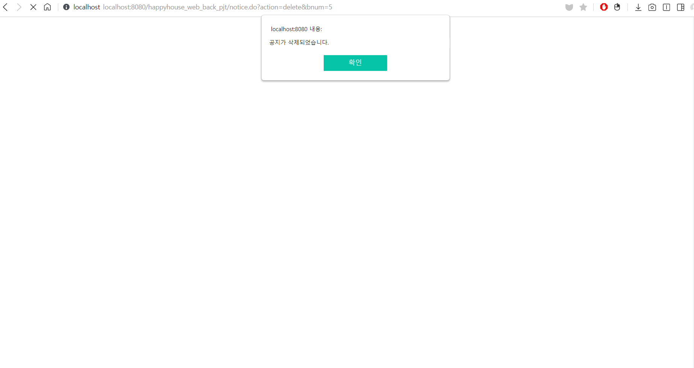     
  

### (2) 공지사항 게시글 검색

### ㄱ) 제목으로 검색  
   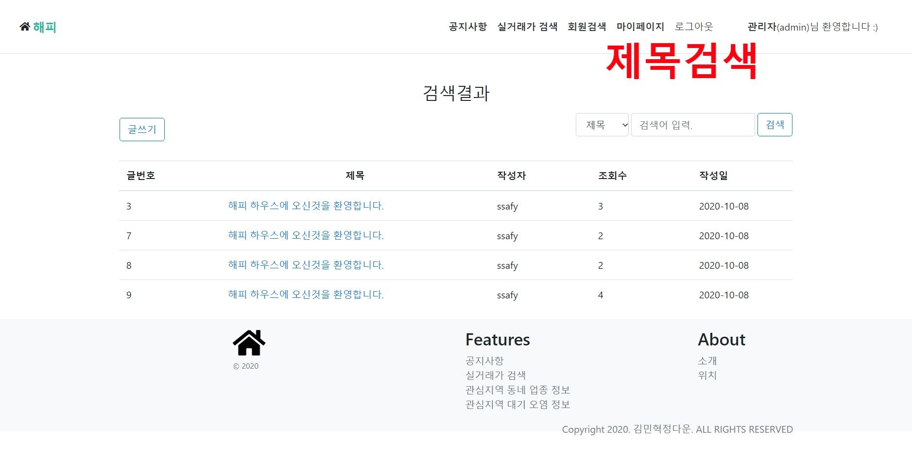  

### ㄴ) 내용으로 검색
   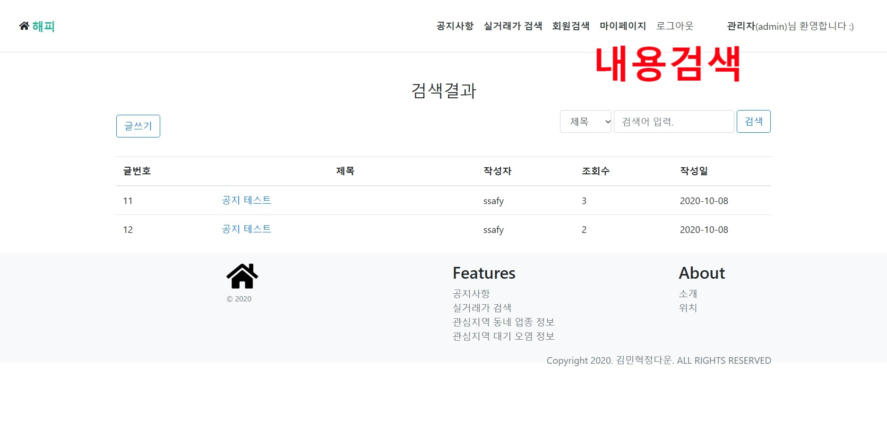  

### ㄷ) 작성자로 검색  
   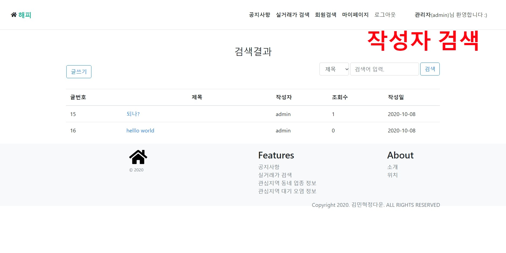   

-------------------------------------------------------------------------------------------------

## :purple_heart: 4. 구현 예정  

### 1) 지하철 역으로 검색  

### 지하철 역 이름으로 검색하면 해당 역 인근 매물을 보여줍니다  

### 2) 부동산 관련 뉴스  

### 부동산 관련 뉴스를 크롤링해 보여줍니다  

### 3) 해당 매물 주변 학군 정보  

### 매물 인근 초, 중, 고교의 학교 정보를 보여줍니다  

### 4) 소셜 로그인  

### 5) thymeleaf를 이용해 jsp파일을 html파일로 변경  

### 6) Spring Security를 이용해 로그인, 로그인 체크 구현  

